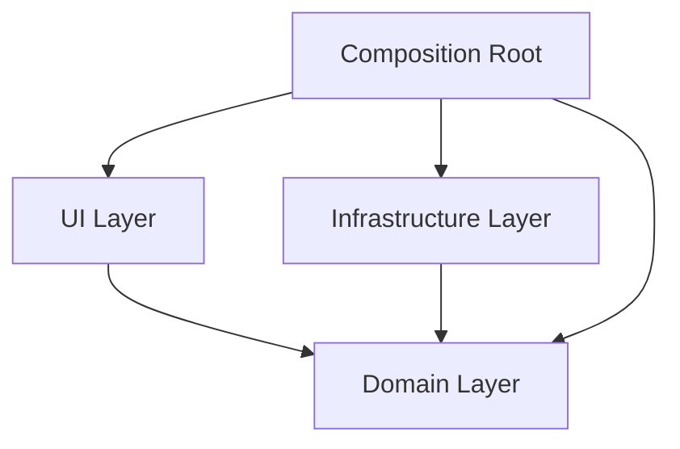
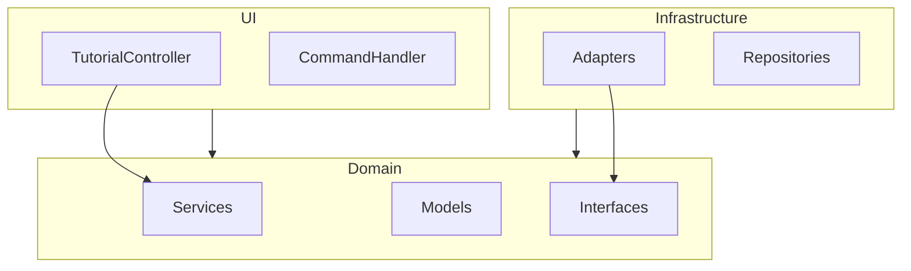
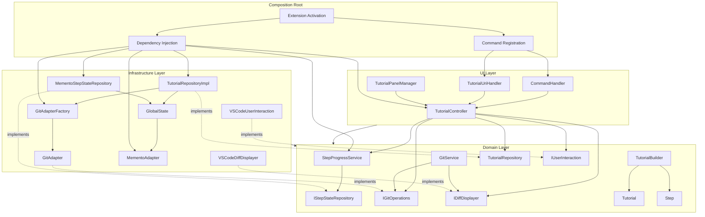
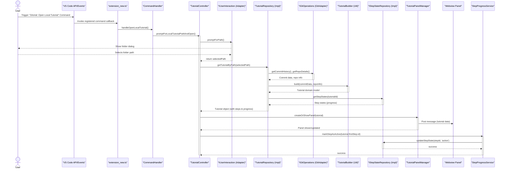

# Very Basic

```mermaid
graph TD
    A[UI Layer] --> B[Domain Layer]
    C[Infrastructure Layer] --> B
    D[Composition Root] --> A
    D --> B
    D --> C
```

# Basic

```mermaid
    graph TD
    subgraph UI
        UI1[TutorialController]
        UI2[CommandHandler]
    end
    
    subgraph Domain
        D1[Services]
        D2[Models]
        D3[Interfaces]
    end
    
    subgraph Infrastructure
        I1[Adapters]
        I2[Repositories]
    end
    
    UI1 --> D1
    I1 --> D3
    UI --> Domain
    Infrastructure --> Domain
```

# Intermediate

```mermaid
graph TD
    subgraph UI[UI Layer]
        TC[TutorialController]
        CH[CommandHandler]
        TUH[TutorialUriHandler]
        TPM[TutorialPanelManager]
    end
    
    subgraph Domain[Domain Layer]
        SPS[StepProgressService]
        GS[GitService]
        TB[TutorialBuilder]
        
        TR_PORT[TutorialRepository]
        STEP_PORT[IStepStateRepository]
        GIT_PORT[IGitOperations]
        DIFF_PORT[IDiffDisplayer]
        UI_PORT[IUserInteraction]
        
        T_MODEL[Tutorial]
        S_MODEL[Step]
    end
    
    subgraph Infrastructure[Infrastructure Layer]
        TR_IMPL[TutorialRepositoryImpl]
        SSR_IMPL[MementoStepStateRepository]
        GA[GitAdapter]
        VDD[VSCodeDiffDisplayer]
        VUI[VSCodeUserInteraction]
        
        GS_UTIL[GlobalState]
        MA[MementoAdapter]
        GAF[GitAdapterFactory]
    end
    
    subgraph Root[Composition Root]
        ACTIVATE[Extension Activation]
        DI[Dependency Injection]
        CMD_REG[Command Registration]
    end
    
    %% UI Components Relationships
    CH --> TC
    TUH --> TC
    TPM --> TC
    
    %% UI to Domain Relationships
    TC --> TR_PORT
    TC --> SPS
    TC --> GIT_PORT
    TC --> DIFF_PORT
    TC --> UI_PORT
    
    %% Domain Relationships
    SPS --> STEP_PORT
    GS --> GIT_PORT
    GS --> DIFF_PORT
    TB --> T_MODEL
    TB --> S_MODEL
    
    %% Implementation Relationships
    TR_IMPL -.->|implements| TR_PORT
    SSR_IMPL -.->|implements| STEP_PORT
    GA -.->|implements| GIT_PORT
    VDD -.->|implements| DIFF_PORT
    VUI -.->|implements| UI_PORT
    
    %% Infrastructure Relationships
    TR_IMPL --> GS_UTIL
    TR_IMPL --> GAF
    SSR_IMPL --> GS_UTIL
    GS_UTIL --> MA
    GAF --> GA
    
    %% Composition Root Relationships
    DI --> TC
    DI --> SPS
    DI --> TR_IMPL
    DI --> SSR_IMPL
    DI --> GAF
    DI --> MA
    ACTIVATE --> DI
    ACTIVATE --> CMD_REG
    CMD_REG --> CH
    CMD_REG --> TUH
    
    %% Layer Dependencies
    UI --> Domain
    Infrastructure --> Domain
```

# Advanced

```mermaid
graph TD
    subgraph UI_Layer[UI Layer]
        TC_UI[TutorialController]
        CH_UI[CommandHandler]
        TUH_UI[TutorialUriHandler]
        TPM_UI[TutorialPanelManager]
        TVMV_UI[TutorialViewModel / Webview]

        CH_UI --> TC_UI
        TUH_UI --> TC_UI
        TPM_UI --> TC_UI
        TPM_UI --> TVMV_UI
    end

    subgraph Domain_Layer[Domain Layer]
        TM_DOM[Tutorial Model]
        SM_DOM[Step Model]
        DCM_DOM[DomainCommit Model]

        SPS_DOM[StepProgressService]
        GS_DOM[GitService]
        TB_DOM[TutorialBuilder]

        ISS_PORT[IStateStorage]
        IGO_PORT[IGitOperations]
        IDD_PORT[IDiffDisplayer]
        IUI_PORT[IUserInteraction]
        IPR_PORT[IProgressReporter]
        TR_PORT[TutorialRepository]
        ISSR_PORT[IStepStateRepository]

        SPS_DOM --> ISSR_PORT
        GS_DOM --> IGO_PORT
        GS_DOM --> IDD_PORT
    end

    subgraph Infra_Layer[Infrastructure Layer]
        MA_INFRA[MementoAdapter]
        GA_INFRA[GitAdapter]
        VDD_INFRA[VSCodeDiffDisplayer]
        VUI_INFRA[VSCodeUserInteraction]
        VPR_INFRA[VSCodeProgressReporter]

        TRI_INFRA[TutorialRepositoryImpl]
        SSRI_INFRA[MementoStepStateRepository]

        GS_INFRA[GlobalState]
        SDB_INFRA[StateDB]
        GAF_INFRA[GitAdapterFactory]

        MA_INFRA --> VSAPI_MEM[vscode.Memento]
        GA_INFRA --> SG_API[simple-git]
        VDD_INFRA --> VSAPI_DIFF[vscode.diff]
        VUI_INFRA --> VSAPI_WIN[vscode.window]
        VPR_INFRA --> VSAPI_PROG[vscode.withProgress]

        TRI_INFRA --> GS_INFRA
        TRI_INFRA --> GAF_INFRA
        TRI_INFRA --> TB_DOM
        TRI_INFRA --> IDD_PORT

        SSRI_INFRA --> GS_INFRA
        GS_INFRA --> MA_INFRA
        GS_INFRA -.-> SDB_INFRA
        GAF_INFRA -.-> GA_INFRA
    end

    subgraph Comp_Root[Composition Root]
        AF_ROOT[activate]
        VSREG_ROOT[VS Code Registrations]
        DI_ROOT[DI Logic]

        AF_ROOT --> DI_ROOT
        AF_ROOT --> VSREG_ROOT
        VSREG_ROOT --> CH_UI
        VSREG_ROOT --> TUH_UI
    end

    %% Cross-layer relationships
    TC_UI --> TR_PORT
    TC_UI --> SPS_DOM
    TC_UI --> IDD_PORT
    TC_UI --> IUI_PORT
    TC_UI --> IPR_PORT
    TC_UI --> GAF_INFRA

    %% Implementation relationships
    MA_INFRA -.->|implements| ISS_PORT
    GA_INFRA -.->|implements| IGO_PORT
    VDD_INFRA -.->|implements| IDD_PORT
    VUI_INFRA -.->|implements| IUI_PORT
    VPR_INFRA -.->|implements| IPR_PORT
    TRI_INFRA -.->|implements| TR_PORT
    SSRI_INFRA -.->|implements| ISSR_PORT

    %% Dependency Injection
    DI_ROOT --> MA_INFRA
    DI_ROOT --> GAF_INFRA
    DI_ROOT --> VDD_INFRA
    DI_ROOT --> VUI_INFRA
    DI_ROOT --> VPR_INFRA
    DI_ROOT --> GS_INFRA
    DI_ROOT --> TRI_INFRA
    DI_ROOT --> SSRI_INFRA
    DI_ROOT --> SPS_DOM
    DI_ROOT --> TC_UI
    DI_ROOT --> CH_UI
    DI_ROOT --> TUH_UI
    DI_ROOT --> TPM_UI

    %% Layer dependencies
    UI_Layer --> Domain_Layer
    Infra_Layer --> Domain_Layer
    Comp_Root --> UI_Layer
    Comp_Root --> Domain_Layer
    Comp_Root --> Infra_Layer
```

# Expert

```mermaid
sequenceDiagram
    actor User
    participant VSCode as "VS Code API/Events"
    participant ExtNew as "extension_new.ts"
    participant CmdHandler as "CommandHandler"
    participant TutorialCtrl as "TutorialController"
    participant UserInteract_UI as "IUserInteraction (Adapter)"
    participant TutorialRepo_Infra as "TutorialRepository (Impl)"
    participant GitOps_Infra as "IGitOperations (GitAdapter)"
    participant TutorialBuilder_Dom as "TutorialBuilder (Util)"
    participant StepStateRepo_Infra as "IStepStateRepository (Impl)"
    participant PanelMgr_UI as "TutorialPanelManager"
    participant Webview_UI as "Webview Panel"
    participant StepProgress_Svc as "StepProgressService"

    User->>VSCode: Trigger "Gitorial: Open Local Tutorial" Command
    VSCode->>ExtNew: Invoke registered command callback
    ExtNew->>CmdHandler: handleOpenLocalTutorial()
    CmdHandler->>TutorialCtrl: promptForLocalTutorialPathAndOpen()
    activate TutorialCtrl
        TutorialCtrl->>UserInteract_UI: promptForPath()
        activate UserInteract_UI
            UserInteract_UI-->>User: Show folder dialog
            User-->>UserInteract_UI: Selects folder path
        UserInteract_UI-->>TutorialCtrl: return selectedPath
        deactivate UserInteract_UI

        TutorialCtrl->>TutorialRepo_Infra: getTutorialByPath(selectedPath)
        activate TutorialRepo_Infra
            %% TutorialRepositoryImpl uses GitAdapterFactory to get/create GitAdapter (IGitOperations)
            TutorialRepo_Infra->>GitOps_Infra: getCommitHistory(), getRepoDetails()
            activate GitOps_Infra
                GitOps_Infra-->>TutorialRepo_Infra: Commit data, repo info
            deactivate GitOps_Infra

            TutorialRepo_Infra->>TutorialBuilder_Dom: build(commitData, repoInfo)
            activate TutorialBuilder_Dom
                TutorialBuilder_Dom-->>TutorialRepo_Infra: Tutorial domain model
            deactivate TutorialBuilder_Dom
            
            TutorialRepo_Infra->>StepStateRepo_Infra: getStepStates(tutorialId)
            activate StepStateRepo_Infra
                StepStateRepo_Infra-->>TutorialRepo_Infra: Step states (progress)
            deactivate StepStateRepo_Infra
            
        TutorialRepo_Infra-->>TutorialCtrl: Tutorial object (with steps & progress)
        deactivate TutorialRepo_Infra

        TutorialCtrl->>PanelMgr_UI: createOrShowPanel(tutorial)
        activate PanelMgr_UI
            PanelMgr_UI->>Webview_UI: Post message (tutorial data)
            PanelMgr_UI-->>TutorialCtrl: Panel shown/updated
        deactivate PanelMgr_UI
        
        TutorialCtrl->>StepProgress_Svc: markStepAsActive(tutorial.firstStep.id)
        activate StepProgress_Svc
             StepProgress_Svc->>StepStateRepo_Infra: updateStepState(stepId, 'active')
             activate StepStateRepo_Infra
                %% StepStateRepo_Infra (MementoStepStateRepo) -> GlobalState -> MementoAdapter -> vscode.Memento
                StepStateRepo_Infra-->>StepProgress_Svc: success
             deactivate StepStateRepo_Infra
        StepProgress_Svc-->>TutorialCtrl: success
        deactivate StepProgress_Svc
    deactivate TutorialCtrl
```
