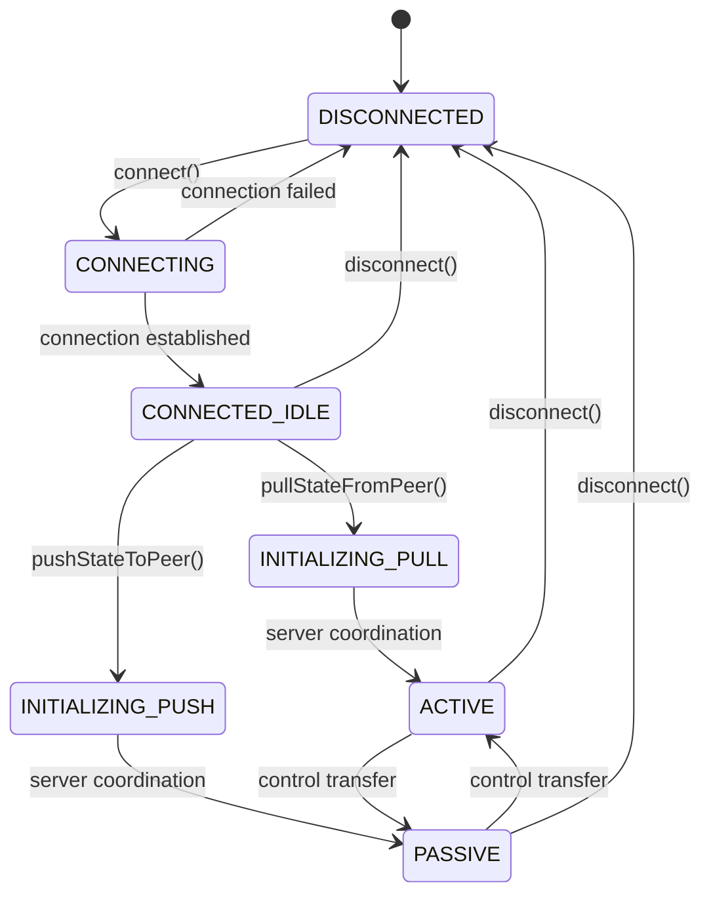

# Architecture Guide

This document provides a comprehensive overview of the `@gitorial/sync-client` architecture, focusing on the modular design patterns, sync phase management, and the orchestrator pattern used for session management.

## 🏗️ Overall Architecture

The package is built around a **Clean Architecture** pattern with clear separation between UI, Domain, and Infrastructure layers:

```
┌─────────────────────────────────────────────────────────────┐
│                        UI Layer                             │
│  ┌─────────────────┐  ┌─────────────────┐                  │
│  │   RelayClient   │  │  Event Handlers │                  │
│  │   (Public API)  │  │                 │                  │
│  └─────────────────┘  └─────────────────┘                  │
└─────────────────────────────────────────────────────────────┘
┌─────────────────────────────────────────────────────────────┐
│                      Domain Layer                           │
│  ┌─────────────────┐  ┌─────────────────┐                  │
│  │ Sync Phase      │  │ Session Models  │                  │
│  │ State Machine   │  │                 │                  │
│  └─────────────────┘  └─────────────────┘                  │
└─────────────────────────────────────────────────────────────┘
┌─────────────────────────────────────────────────────────────┐
│                   Infrastructure Layer                      │
│  ┌─────────────────┐  ┌─────────────────┐                  │
│  │ WebSocket       │  │ HTTP Session    │                  │
│  │ Connection      │  │ Management      │                  │
│  └─────────────────┘  └─────────────────┘                  │
└─────────────────────────────────────────────────────────────┘
```

## 🎭 Orchestrator Pattern

The core of the server-side architecture is the **RelaySessionOrchestrator**, which implements the Orchestrator pattern to coordinate multiple specialized components.

### Component Separation

Instead of a monolithic `RelaySessionManager`, we have:

```typescript
// Old: Monolithic approach (765 lines)
class RelaySessionManager {
  // Everything in one class:
  // - Session CRUD
  // - Connection management  
  // - WebSocket handling
  // - Cleanup logic
  // - Role management
  // - Message routing
}

// New: Orchestrator pattern (595 lines + focused components)
class RelaySessionOrchestrator {
  private sessionStore: SessionStore;              // Session data management
  private lifecycleManager: SessionLifecycleManager; // Cleanup & expiration
  private connectionManager: ConnectionManager;     // WebSocket connections
  
  // Coordinates between components
  // Handles WebSocket upgrades
  // Routes messages
  // Manages event forwarding
}
```

### Key Components

#### 1. **SessionStore** (`src/server/stores/SessionStore.ts`)
- **Responsibility**: Session CRUD operations and data management
- **Pattern**: Repository pattern
- **Features**:
  - In-memory session storage with Map-based indexing
  - Session status lifecycle (ACTIVE → EXPIRED → DELETED)
  - Metadata management
  - Activity tracking
  - Future-ready for Redis implementation

```typescript
class SessionStore extends EventEmitter {
  create(options: CreateSessionOptions): SessionData;
  get(sessionId: string): SessionData | null;
  updateActivity(sessionId: string): boolean;
  delete(sessionId: string): boolean;
  list(): SessionData[];
  getExpiredSessions(): string[];
  markExpired(sessionId: string): boolean;
}
```

#### 2. **SessionLifecycleManager** (`src/server/manager/SessionLifecycleManager.ts`)
- **Responsibility**: Background session cleanup and health monitoring
- **Pattern**: Service layer with timer-based operations
- **Features**:
  - Automatic session expiration detection
  - Periodic cleanup tasks
  - Configurable cleanup intervals
  - Event emission for lifecycle changes

```typescript
class SessionLifecycleManager extends EventEmitter {
  start(): void;
  stop(): void;
  isActive(): boolean;
  // Private: cleanup timers and health checks
}
```

#### 3. **ConnectionManager** (`src/server/manager/ConnectionManager.ts`)
- **Responsibility**: WebSocket connection lifecycle and role management
- **Pattern**: Manager pattern with indexed access
- **Features**:
  - Connection storage and retrieval
  - Role assignment (CONNECTED → ACTIVE/PASSIVE)
  - Session-to-connection mapping
  - Connection health monitoring
  - Graceful connection cleanup

```typescript
class ConnectionManager extends EventEmitter {
  addConnection(sessionId: string, connection: RelayConnection): boolean;
  removeConnection(connectionId: string): boolean;
  setConnectionRole(connectionId: string, role: ClientRole): boolean;
  findActiveConnection(sessionId: string): RelayConnection | null;
  getSessionConnections(sessionId: string): RelayConnection[];
  closeAllConnections(sessionId: string): void;
}
```

#### 4. **RelaySessionOrchestrator** (`src/server/RelaySessionOrchestrator.ts`)
- **Responsibility**: Coordination and message routing
- **Pattern**: Orchestrator/Facade pattern
- **Features**:
  - Event forwarding between components
  - WebSocket upgrade handling
  - Message routing and protocol handling
  - Component lifecycle coordination
  - Public API facade

## 🔄 Sync Phase Management

The client implements an explicit state machine for connection and role management, moving away from implicit state handling.

### State Machine Overview



### Phase Definitions

| Phase | Description | Capabilities | Transitions |
|-------|-------------|--------------|-------------|
| **DISCONNECTED** | No connection to relay | None | → CONNECTING |
| **CONNECTING** | Establishing WebSocket connection | None | → CONNECTED_IDLE, DISCONNECTED |
| **CONNECTED_IDLE** | Connected, no sync direction chosen | Choose direction | → INITIALIZING_PULL/PUSH |
| **INITIALIZING_PULL** | Requesting ACTIVE role from server | Wait for coordination | → ACTIVE |
| **INITIALIZING_PUSH** | Requesting PASSIVE role from server | Wait for coordination | → PASSIVE |
| **ACTIVE** | Has control, can send/request state | Full capabilities | ↔ PASSIVE |
| **PASSIVE** | Receives state, limited sending | Receive state | ↔ ACTIVE |

### Sync Phase Implementation

```typescript
// src/client/types/sync-phases.ts
export enum SyncPhase {
  DISCONNECTED = 'disconnected',
  CONNECTING = 'connecting', 
  CONNECTED_IDLE = 'connected_idle',
  INITIALIZING_PULL = 'initializing_pull',
  INITIALIZING_PUSH = 'initializing_push',
  ACTIVE = 'active',
  PASSIVE = 'passive'
}

export class SyncPhaseStateMachine {
  private currentPhase: SyncPhase = SyncPhase.DISCONNECTED;
  
  transition(newPhase: SyncPhase, reason?: string): boolean {
    if (!this.isValidTransition(this.currentPhase, newPhase)) {
      return false;
    }
    
    const oldPhase = this.currentPhase;
    this.currentPhase = newPhase;
    this.emit('syncPhaseChanged', { oldPhase, newPhase, reason });
    return true;
  }
  
  private isValidTransition(from: SyncPhase, to: SyncPhase): boolean {
    return VALID_TRANSITIONS[from]?.includes(to) ?? false;
  }
}
```

### Permission-Based Operations

Each sync phase has specific permissions for what operations are allowed:

```typescript
export class SyncPhasePermissions {
  static canSendTutorialState(phase: SyncPhase): boolean {
    return phase === SyncPhase.ACTIVE;
  }
  
  static canRequestTutorialState(phase: SyncPhase): boolean {
    return phase === SyncPhase.ACTIVE || phase === SyncPhase.INITIALIZING_PULL;
  }
  
  static canChooseSyncDirection(phase: SyncPhase): boolean {
    return phase === SyncPhase.CONNECTED_IDLE;
  }
  
  static canTransferControl(phase: SyncPhase): boolean {
    return phase === SyncPhase.ACTIVE || phase === SyncPhase.PASSIVE;
  }
}
```

## 🔌 Connection and Message Flow

### WebSocket Upgrade Flow

```typescript
// RelaySessionOrchestrator handles upgrades
handleUpgrade(sessionId: string, socket: WebSocket, request: IncomingMessage): boolean {
  // 1. Validate session exists
  const session = this.sessionStore.getInternal(sessionId);
  if (!session) {
    socket.close(1008, 'Session not found');
    return false;
  }

  // 2. Create connection object
  const connection: RelayConnection = {
    id: this.generateConnectionId(),
    sessionId,
    socket,
    connectedAt: new Date(),
    lastPing: new Date(),
    role: ClientRole.CONNECTED, // Start as CONNECTED
    lastRoleChange: new Date()
  };

  // 3. Register with ConnectionManager
  if (!this.connectionManager.addConnection(sessionId, connection)) {
    socket.close(1011, 'Failed to add connection');
    return false;
  }

  // 4. Update session activity
  this.sessionStore.updateActivity(sessionId);

  // 5. Setup message handlers
  this.setupWebSocketHandlers(connection);

  return true;
}
```

### Message Routing

The orchestrator routes messages based on type and current connection roles:

```typescript
private handleWebSocketMessage(connection: RelayConnection, data: any): void {
  try {
    const message: SyncMessage = JSON.parse(data.toString());
    
    switch (message.type) {
      case SyncMessageType.SYNC_DIRECTION_REQUEST:
        this.handleSyncDirectionCoordination(connection, message);
        break;
        
      case SyncMessageType.CONTROL_REQUEST:
        this.handleControlRequest(connection, message);
        break;
        
      case SyncMessageType.TUTORIAL_STATE:
      case SyncMessageType.REQUEST_TUTORIAL_STATE:
        this.routeMessage(connection, message);
        break;
        
      default:
        this.routeMessage(connection, message);
    }
  } catch (error) {
    console.error('Invalid message format:', error);
  }
}
```

## 🎯 Design Patterns Used

### 1. **Orchestrator Pattern**
- **Where**: `RelaySessionOrchestrator`
- **Why**: Coordinates multiple specialized components without coupling them
- **Benefits**: Single point of control, easy testing, clear responsibilities

### 2. **Repository Pattern**
- **Where**: `SessionStore`
- **Why**: Abstracts data persistence, future-ready for different backends
- **Benefits**: Testable, swappable implementations (Memory → Redis)

### 3. **State Machine Pattern**
- **Where**: `SyncPhaseStateMachine`
- **Why**: Explicit state management with clear transition rules
- **Benefits**: Predictable behavior, easy debugging, prevent invalid states

### 4. **Event-Driven Architecture**
- **Where**: Throughout (EventEmitter pattern)
- **Why**: Loose coupling between components
- **Benefits**: Reactive updates, easy to extend, testable

### 5. **Dependency Injection**
- **Where**: RelaySessionOrchestrator constructor
- **Why**: Components can be tested in isolation
- **Benefits**: Mockable dependencies, flexible configuration

### 6. **Factory Pattern**
- **Where**: Connection and session creation
- **Why**: Standardized object creation with proper initialization
- **Benefits**: Consistent object state, easy to modify creation logic

## 🧪 Testing Architecture

### Component Isolation

Each component can be unit tested independently:

```typescript
// SessionStore can be tested without WebSocket concerns
describe('SessionStore', () => {
  let store: SessionStore;
  
  beforeEach(() => {
    store = new SessionStore(60000, ConflictResolution.FIRST_COME_FIRST_SERVED);
  });
  
  it('should create session with proper defaults', () => {
    const session = store.create({ metadata: { tutorial: 'test' } });
    expect(session.id).to.be.a('string');
    expect(session.status).to.equal(SessionStatus.ACTIVE);
  });
});

// ConnectionManager can be tested without session logic
describe('ConnectionManager', () => {
  let manager: ConnectionManager;
  let mockConnection: RelayConnection;
  
  beforeEach(() => {
    manager = new ConnectionManager();
    mockConnection = createMockConnection();
  });
  
  it('should manage connection roles', () => {
    manager.addConnection('session1', mockConnection);
    manager.setConnectionRole(mockConnection.id, ClientRole.ACTIVE);
    
    const activeConn = manager.findActiveConnection('session1');
    expect(activeConn?.role).to.equal(ClientRole.ACTIVE);
  });
});
```

### Integration Testing

Integration tests verify the orchestrator coordinates components correctly:

```typescript
describe('RelaySessionOrchestrator Integration', () => {
  let orchestrator: RelaySessionOrchestrator;
  
  beforeEach(() => {
    orchestrator = new RelaySessionOrchestrator({
      sessionTimeoutMs: 60000,
      cleanupIntervalMs: 5000
    });
    orchestrator.start();
  });
  
  it('should handle full client lifecycle', async () => {
    // Test session creation → connection → role assignment → message routing
    const session = orchestrator.createSession();
    
    const mockSocket = new MockWebSocket();
    const success = orchestrator.handleUpgrade(session.id, mockSocket, mockRequest);
    
    expect(success).to.be.true;
    expect(orchestrator.getStats().connections.total).to.equal(1);
  });
});
```

## 🔄 Event Flow and Coordination

### Component Event Forwarding

The orchestrator sets up event forwarding to create a cohesive system:

```typescript
private setupEventForwarding(): void {
  // Forward lifecycle events
  this.lifecycleManager.on('sessionExpired', (sessionId) => {
    this.connectionManager.closeAllConnections(sessionId);
    this.emit('sessionExpired', sessionId);
  });

  this.lifecycleManager.on('sessionDeleted', (sessionId) => {
    this.emit('sessionDeleted', sessionId);
  });

  // Forward connection events
  this.connectionManager.on('clientConnected', (sessionId, connectionId) => {
    this.emit('clientConnected', sessionId, connectionId);
  });

  this.connectionManager.on('clientDisconnected', (sessionId, connectionId) => {
    this.emit('clientDisconnected', sessionId, connectionId);
  });
}
```

### Sync Direction Coordination

When a client requests a sync direction, the orchestrator coordinates with other clients:

```typescript
private handleSyncDirectionCoordination(connection: RelayConnection, message: SyncMessage): void {
  const request = message.data as SyncDirectionRequest;
  const sessionConnections = this.connectionManager.getSessionConnections(connection.sessionId);

  if (sessionConnections.length === 1) {
    // Single client - assign requested direction immediately
    this.assignSyncDirection(connection, request.preferredDirection, 'Single client session');
  } else {
    // Multi-client session - coordinate roles
    this.assignSyncDirection(connection, request.preferredDirection, 'Sync direction coordination');
    
    // Assign complementary direction to other clients
    const complementaryDirection = request.preferredDirection === 'ACTIVE' ? 'PASSIVE' : 'ACTIVE';
    this.assignOtherClientsDirection(session, connection, complementaryDirection, 'Complementary sync direction');
  }
}
```

## 📊 Performance Considerations

### Memory Management

- **Connection Cleanup**: Automatic cleanup when WebSockets close
- **Session Expiration**: Background cleanup of expired sessions  
- **Event Listener Management**: Proper cleanup to prevent memory leaks
- **Map-based Indexing**: O(1) lookups for sessions and connections

### Scalability Features

- **Component Separation**: Easy to scale individual components
- **Event-Driven**: Non-blocking operations
- **Configurable Timeouts**: Tunable for different deployment scenarios
- **Future Redis Support**: SessionStore designed for distributed scenarios

### Network Efficiency

- **Message Routing**: Direct routing between relevant clients only
- **Role-Based Messaging**: Prevents unnecessary message broadcasts
- **Connection Pooling**: Reuse WebSocket connections efficiently
- **Ping/Pong Health Checks**: Detect and clean up dead connections

## 🔮 Future Extensions

The modular architecture makes it easy to extend:

### New Storage Backends
```typescript
// Easy to implement Redis store
class RedisSessionStore extends SessionStore {
  async create(options: CreateSessionOptions): Promise<SessionData> {
    // Redis implementation
  }
}
```

### Additional Role Types
```typescript
enum ClientRole {
  CONNECTED = 'connected',
  ACTIVE = 'active',
  PASSIVE = 'passive',
  OBSERVER = 'observer',    // New: read-only access
  MODERATOR = 'moderator'   // New: can manage other clients
}
```

### Message Middleware
```typescript
class MessageMiddleware {
  process(message: SyncMessage, connection: RelayConnection): SyncMessage {
    // Validation, transformation, logging, etc.
    return message;
  }
}
```

### Metrics and Monitoring
```typescript
class SessionMetrics extends EventEmitter {
  trackConnection(sessionId: string, connectionId: string): void;
  trackMessage(type: SyncMessageType): void;
  getMetrics(): SessionMetricsData;
}
```

This architecture provides a solid foundation for real-time tutorial synchronization while maintaining flexibility for future requirements and easy testing of individual components. 